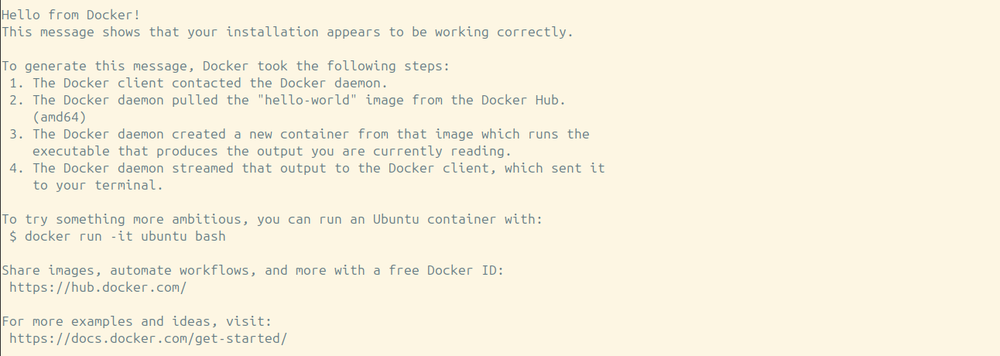

# 1. Set-up 

You only need to install two softwares to run the pipeline. Docker is used to run any software in a containerized environment where you can work with any software witihout installation issue on any machine. Nextflow is used to run the quantms pipeline. It is a collection of bioinformatics pipelines including quantms which we used it to extract mass spectrometry data from mass spectrometer. By having these two softwares, you can run the mass spectrometry pipeline on any machine. Simple and easy, right? You can also now analyse it with your own laptop. Remember to have enough space for data storage and memory for the pipeline to run. This exercise requires at least 70 GB of free space and 8 GB of memory.

There may be some issues with the installation of Docker and Nextflow. Of course, different operating systems may have different steps to install the softwares. Please refer to the official documentation for more information.

1. [Docker](https://docs.docker.com/engine/install/)


2. [Nextflow](https://www.nextflow.io/docs/latest/install.html) 

# 2. Links 
For further information, please refer to the following links. 
- [Nextflow](https://www.nextflow.io/)
- [quantms](https://docs.quantms.org/en/latest/) 
- [msstats](https://bioconductor.org/packages/release/bioc/html/MSstats.html) 
- [PRIDE](https://www.ebi.ac.uk/pride/) 

# 3. Running 
## Check you installations 
0. Open your terminal.
1. Docker: 
    ```
    docker run hello-world
    ```

    If you see the message below, you have successfully installed Docker. 
    
    

2. Nextflow: 
    ```
    nextflow run hello
    ``` 

    If you see the message below, you have successfully installed Nextflow. 
    
    

Note: You may need `sudo` to run the command.


## Prepare your files

1. Prepare the SDRF file. It is located in this repo.
2. Download the raw data from [PRIDE](https://www.ebi.ac.uk/pride/archive/). For example, `PXD020109`. 
3. Download the proteome from [Uniprot](https://www.uniprot.org/). You need to download the fasta file of the proteome in a canonical version without the isoforms.

All of the files above should locate in the same directory.

## Run the pipeline 
1. Change your directory to the directory that contains the files.

    ```
    cd </path/to/your/directory>
    ```
    
2. Take a look at SDRF files and raw files. Are they correlated with file numbers abd file names?
3. Run the pipeline. Adjust your file names and paths accordingly with `<>`. In other words, edit the content between `<>` and remove `<>`. Importantly, the quotes (`' or "`) are necessary.
    
    ```
    nextflow run bigbio/quantms -r master --input '<sdrf>.tsv' --outdir 'results' --database '<Organism Proteome>.fasta' -profile docker --root_folder <root directory of your folder> --local_input_type raw --add_decoys true --max_memory 8GB --max_cpus 4
    ```
    One can adjust the memory usage by changing the `--max_memory` parameter. It's recommended to use as much memory as possible but not all of it.
4. The pipeline will run and generate the results in the `results` folder and the intermediate file in `work`. It will take a while to run around an hour. If it crashes, you can resume the pipeline by running the same command and add `-resume`.
5. After the pipeline finishes, you can see some reports similar to the image below. The results are in the `results` folder. 

    
6. Now, you have done your first mass spectrometry data analysis, yay! what we are doing here can shorten the steps in mass spectrometry research from days or months to just an hour, wowww!

# Further readings 

- [quantms](https://www.nature.com/articles/s41592-024-02343-1)
- [lesSDRF](https://www.nature.com/articles/s41467-023-42543-5/)

# Info 
- Course: CB2110 Applied Proteomics, KTH 
- Author: Thanadol Sutantiwanichkul (thanado@kth.se)
- Latest update: 120824
- Version: 0.2.1 